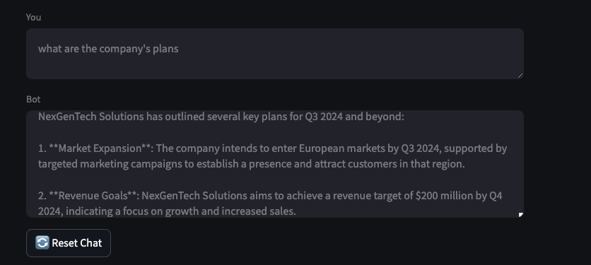
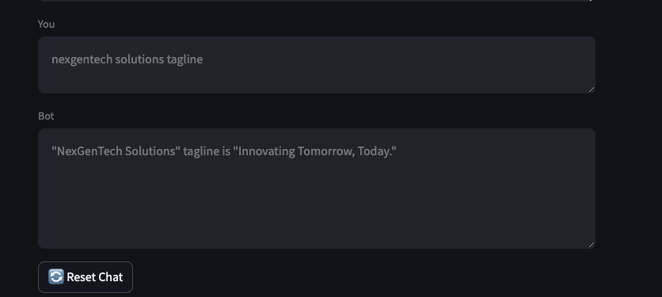
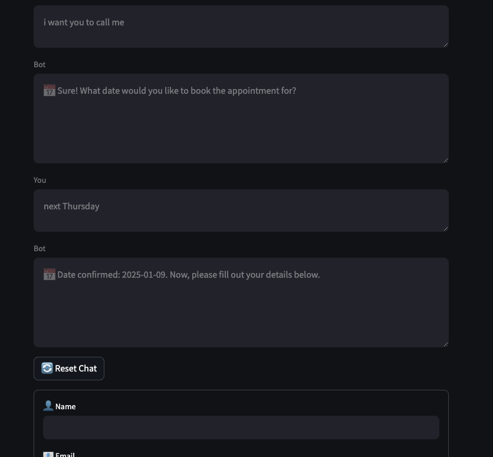
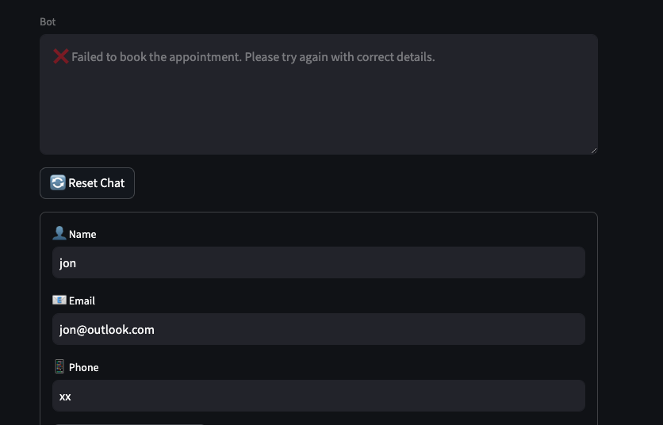
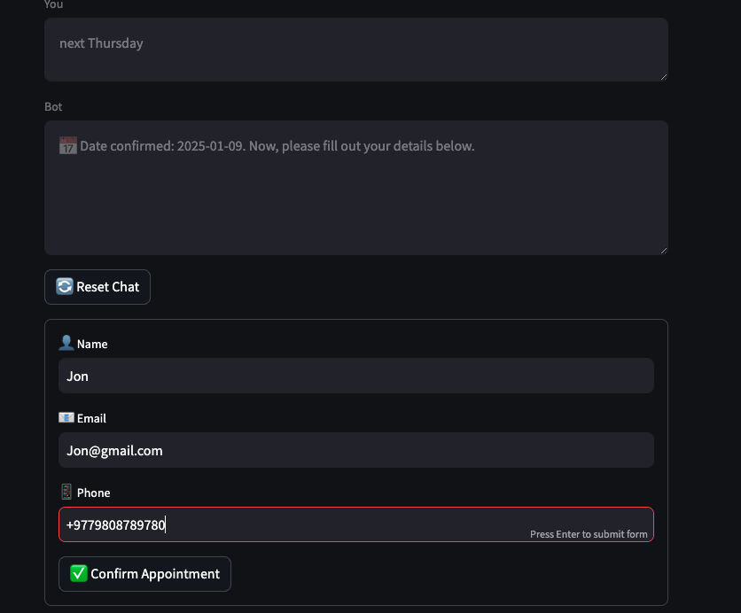
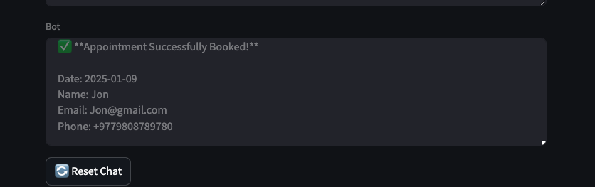

# 🤖 ** Chatbot Document querying, callback scheduling Application**

## 📚 What You'll Find in This README:

1. 📸 **Screenshots** – Visual demonstration of the chatbot interface and features.  
2. 🛠️ **Setup Instructions** – Step-by-step guide to run the chatbot locally.  
3. 📝 **Features Overview** – explanation of key functionalities.  

### **Screenshots of the App in Action**

1. **Document Query:**
   
   

2. **Appointment Booking Flow:**
   
   
   
   


---

## 📚 **Project Overview**

This application is a multi-functional chatbot built with **FastAPI**, **Streamlit**, and **LangChain**. It supports:

- 🗂️ **Document Querying:** Ask questions about ingested documents.
- 📅 **Appointment Booking:** Book appointments with natural date parsing and input validation.
- 💬 **Casual Conversations:** Engage in natural conversations.

---

## 🛠️ **Tech Stack**

- **Backend:** FastAPI  
- **Frontend:** Streamlit  
- **LLM Model:** GPT-4o via OpenAI API  
- **Database:** ChromaDB for document embeddings  

---

## 📦 Setup Instructions

1. **Clone the Repository:**  
   ```
   git clone https://github.com/subidb/ChatBot_N.git
   cd ChatBot_N
    ```
2. **Create and Activate Virtual Environment:**
  ```
     python -m venv venv
     source venv/bin/activate  # On macOS/Linux
     venv\Scripts\activate     # On Windows
  ```
3.  Install Dependencies: 
  ```
     pip install -r requirements.txt
  ```

4. Set Env Variables: 
 ```
     Create a .env file and add
     OPENAI_API_KEY=your_openai_api_key
 ```
   
5. Ingest Documents: 
  ```
     python document_ingest.py
 ```
6. Start Backend Server: 
  ```
     uvicorn main:app --reload
  ```
7. Start Frontend Interface:
  ```
     streamlit run app.py
  ```


## 📝 Features:
🗂️ Document Querying:
  -Ask specific questions about ingested documents.

📅 Appointment Booking
 Understands natural language dates like:
  - "Next Tuesday"
  - "Two weeks from now"
  - "Tomorrowww" (even with typos)

Validates user inputs:
📧 Email: Ensures valid email format.
📱 Phone: Checks phone number format.
Seamlessly walks the user through appointment stages.

📆 Date Parsing
Accurately extracts dates from user queries.
Handles edge cases like relative dates and typos.


